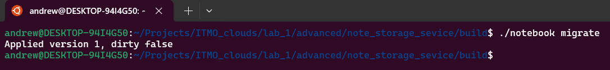
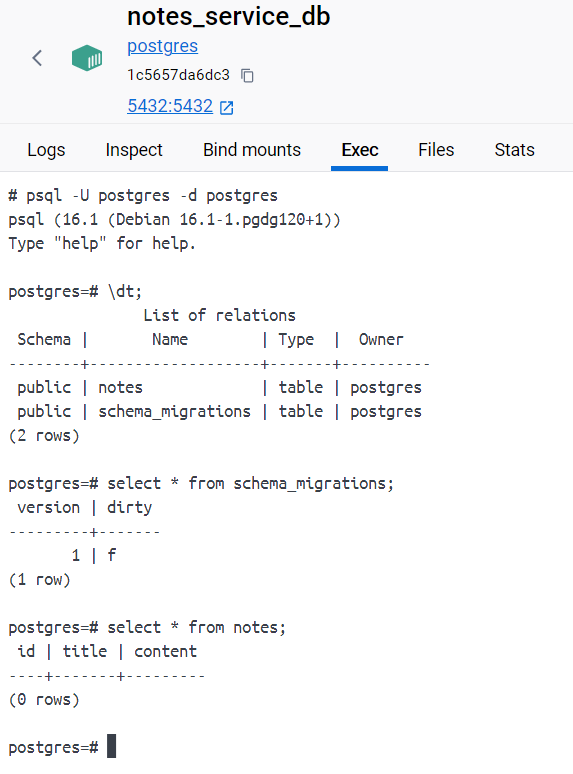
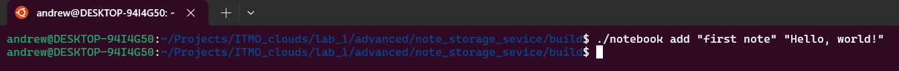
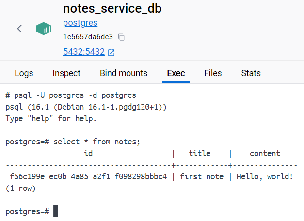
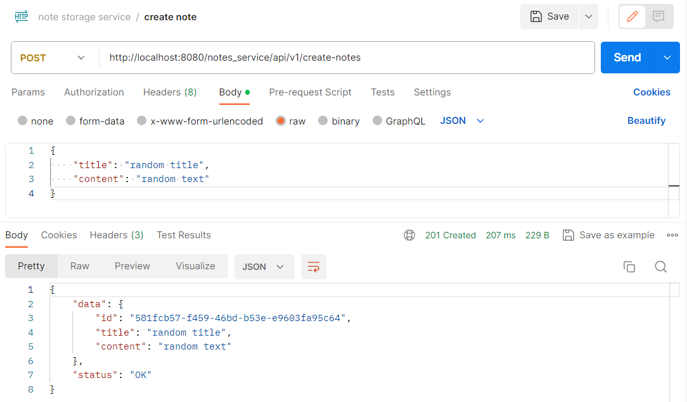
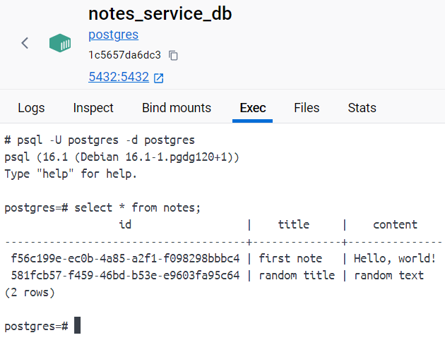
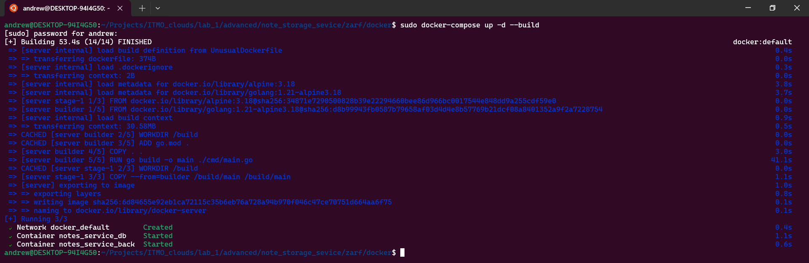
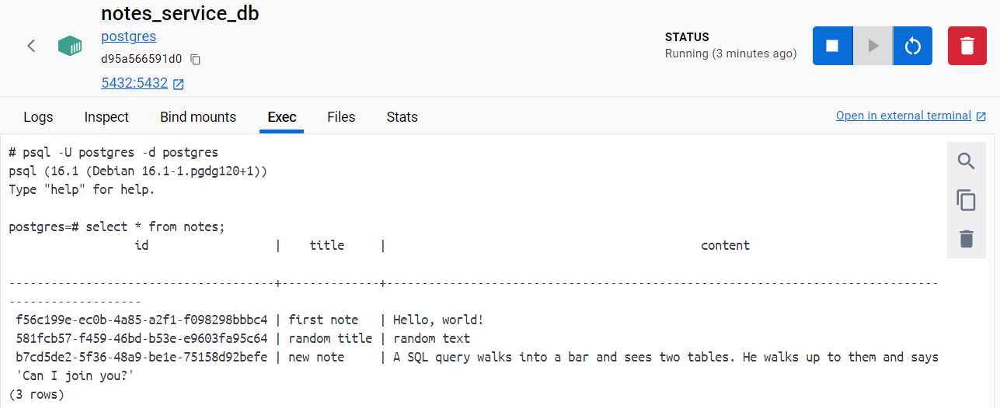

# Лабораторная работа № 1
### Команда
- Соболевская Надежда K34212
- Осипова Валерия K34202
- Гончаров Андрей K34211
- Донина Дарья K34202

## Задание

Реализовать приложение, которое в запущенном контейнере будет записывать изменения в базу данных. Значения для записи должны передаваться в команде запуска контейнера. При остановке контейнера информация не должна исчезать. Файл должен иметь название, отличное от Dockerfile.

## Основная часть
### Создание приложение
В процессе выполнения лабораторной работы было разработано приложение на языке программирования Go для сохранения заметок. В директории migrations представлен код для создания таблицы notes:

```
CREATE EXTENSION IF NOT EXISTS "uuid-ossp";
CREATE TABLE IF NOT EXISTS notes (
    id uuid PRIMARY KEY DEFAULT uuid_generate_v4(),
    title TEXT NOT NULL,
    content TEXT NULL
)
```
Для запуска приложения было разработано три команды:
 - add -  позволяет сохранить значения, которые переданы в виде аргументов командной строки в базу данных;
 - migrate - применят все up миграции для базы данных, которые описаны в директории migrations;
 - run - запускает сервер, которые обрабатывает запросы в формате JSON и реализует CRUD методы.

Применение миграций:





Добавление данных через командную строку:





Добавление данных с помощью REST API:





### Написание Dockerfile

Dockerfile и конфигурация Docker Compose расположены в директории note_storage_service/zarf/docker. Dockerfile был скопирован из директории базовой версии данной лабораторной работы. Однако имя файло было изменено на UnusualDockerfile и для команды запуска приложения в инструкцие CMD были добавлены аргументы для записи в базу данных.

```
FROM golang:1.21-alpine3.18 AS builder

WORKDIR /build

ADD go.mod .

COPY . .

RUN go build -o main ./cmd/main.go

FROM alpine:3.18

WORKDIR /build

COPY --from=builder /build/main /build/main

CMD ["./main", "add", "new note", "A SQL query walks into a bar and sees two tables. He walks up to them and says 'Can I join you?'"]
```

### Конфигурация docker-compose
Взаимодействие контейнера приложения с контейнером базы данных было описано с помощью файла docker-compose.yml. Каждый контейнер представлен в виде службы. Для контейнера базы данных было выбрано имя notes_service_db, в качестве имени образа было указано значение "postres".  Для сохранения данных с помощью тома было определено значение volumes. 

Контейнер приложения был назван notes_service_back. С помощью инструкции build для данного контейнера были определены параметры сборки (указан относительный путь до директории, в которой должна быть выполнена сборка контейнера, и путь до UnusualDockerfile). Для каждого контейнера был задан путь до файла с переменными окружения, были указаны значения для сопоставления портов снаружи и внутри контейнера и была определена политика перезапуска.

```
version: '3.8'

services:
  db:
    container_name: notes_service_db
    image: 'postgres'
    env_file:
      - dev.env 
    ports:
      - 5432:5432 
    volumes:
      - db:/var/lib/postgresql/data
    restart: always

  server:
    container_name: notes_service_back
    build:
      context: ../../
      dockerfile: ./zarf/docker/UnusualDockerfile
    env_file:
      - dev.env
    ports:
      - 8080:8080
    restart: on-failure
    depends_on: 
      - db

volumes:
  db:
```
### Проверка работы
Запустим контейнеры, чтобы проверить сохранение заметок в базу данных с помощью команды add.



Результат:



### Вывод

В результате выполнения лабораторной работы было создано приложение для сохранения заметок на языке Go, для которого был написан Dockerfile и файл конфигурации docker-compose.yml. Приложение обрабатывает несколько команд, включая команду add, которая позволяет сохранить значение аргументов командной строки в базу данных.

Таким образом, в ходе лабораторной работы удалось разработать приложение, которое в процессе обработки запросов обращается к базе данных и разворачивается с помощью инструмента Docker Compose.
