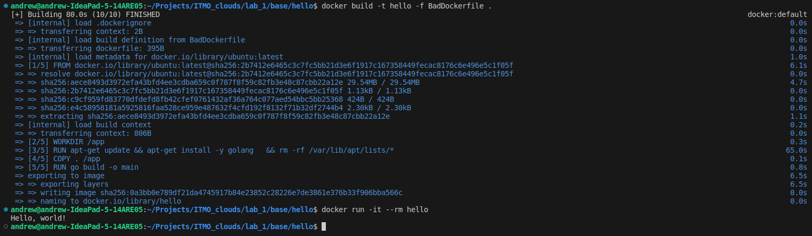
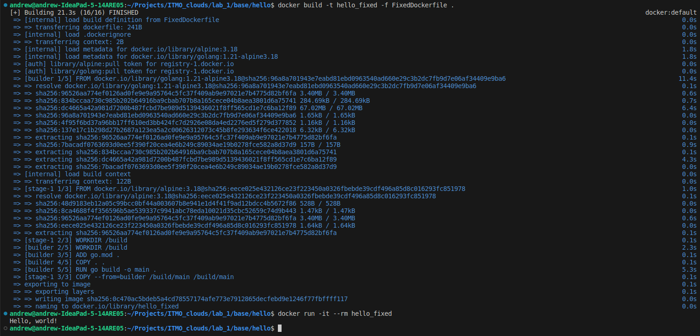
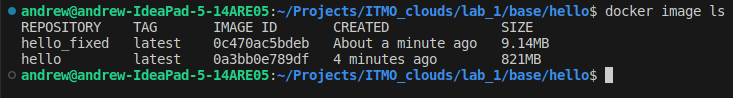

# Лабораторная работа № 1
### Команда
- Соболевская Надежда K34212
- Осипова Валерия K34202
- Гончаров Андрей K34211
- Донина Дарья K34202

## Задание

Написать два Dockerfile – плохой и хороший. Плохой должен запускаться и работать корректно, но в нём должно быть не менее 3 “bad practices”. В хорошем Dockerfile они должны быть исправлены. В Readme описать все плохие практики из кода Dockerfile и почему они плохие, как они были исправлены в хорошем Dockerfile, а также две плохие практики по использованию этого контейнера.

## Основная часть

Рассмотрим работу с Docker контейнерами на примере программы, которая выполняет печать строки “Hello, world!”.

```
package hello

import "fmt"

func main() {
	fmt.Println("Hello, world!")
}
```

### Создание плохого Dockerfile

Содержимое плохого Dockerfile представлено ниже:

```
FROM ubuntu:latest

# создание новой директории
WORKDIR /app

# установка golang
RUN apt-get update
RUN apt-get -y install golang

# копирование всех файлов из директории проекта
COPY . /app

# сборка пакета
RUN go build -o main

CMD ["./main"]
```

Создание образа на основе BadDockerfile и запуск контейнера:



### Bad practice 1

Использование неоптимального базового образа:

```
FROM ubuntu:latest
```

Образ на основе дистрибутива Ubuntu содержит дополнительное программное обеспечение, которое не будет использовано при запуске рассматриваемого контейнера. В данном случае лучше использовать более специфичный образ golang, который поддерживать весь необходимый функционал, но весит значительно меньше.

Также не рекомендуется использовать тег latest, так как в случае появления новой версии базового образа при сборке могут возникнуть ошибки. Всегда стоит указывать конкретную версию образа.

### Bad practice 2

В результате использования образа на основе ubuntu возникает необходимость в установке Go, чтобы выполнить сборку проекта.

```
RUN apt-get update 
RUN apt-get -y install golang
```
Каждая инструкция RUN выполняется на новом слое, что увеличивает накладные расходы. Также результат выполнения команды `apt-get update` будет закеширован и при выполнении команды `apt-get -y install golang` может быть установлена устаревшая версия пакета.

Кроме того, лучше очистить apt кеш в директории /var/lib/apt/lists, чтобы уменьшить размер изображения.

Таким образом, в данном случае лучше написать:

```
RUN apt-get update && apt-get install -y golang \
  && rm -rf /var/lib/apt/lists/*
```


### Bad practice 3

В плохом Dockerfile все файлы директории проекта копируются в контейнер, хотя для запуска контейнера нужен только исполняемый файл.

```
COPY . /app
```

Ненужные файлы увеличивают объем памяти, занимаемый контейнером. Лучше использовать двухэтапную сборку, чтобы уменьшить размер окончательного образа.

### Исправление недочетов

В исправленной версии Dockerfile используется официальный образ для Go контейнеров на основе Alpine Linux. Данный образ по умолчанию содержит все необходимые зависимости для сборки и выполнения программ на Go.

```
FROM golang:1.21-alpine3.18 AS builder

WORKDIR /build

ADD go.mod .

COPY . .

RUN go build -o main .

FROM alpine:3.18

WORKDIR /build

COPY --from=builder /build/main /build/main

CMD [". /main"]
```

 Разделение инструкции внутри FixedDockerfile на отдельные этапы позволяет перенести в контейнер только необходимые для запуска приложения файлы, так как каждая инструкция FROM очищает любое состояние, созданное предыдущими инструкциями.

Создание образа на основе FixedDockerfile и запуск контейнера:



Новый образ весит значительно меньше предыдущего:



### Плохие практики по использованию контейнеров

1. Нельзя хранить данные внутри контейнеров, так как он в любой момент может быть остановлен или уничтожен. Если требуется сохранять данные, нужно использовать тома.      Кроме того, тома часто являются лучшим выбором, чем сохранение данных в записывающем слое контейнера, поскольку том не увеличивает размер использующих его контейнеров, а содержимое тома существует вне жизненного цикла данного контейнера.
2. Нельзя прописывать внутри Dockerfile данные учетных записей, так как эти данные могут быть раскрыты при добавлении Dockerfile в репозиторий на GitHub или при загрузке образа на Docker Hub. Для этой цели нужно использовать переменные окружения, которые можно установить при запуске контейнера с помощью флага -e. 

### Вывод

В результате выполнения лабораторной работы было создано простое приложение на языке Go, для которого было написано два Dockerfile. В первом Dockerfile были представлены плохие практики по созданию образов, а во втором - способы исправления допущенных недочетов. 

Таким образом, в ходе лабораторной работы удалось обнаружить ошибки, допущенные при создании докерфайла, и описать способы их исправления. Также были рассмотрены плохие практики по использованию контейнеров.
