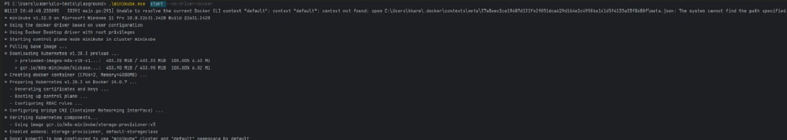
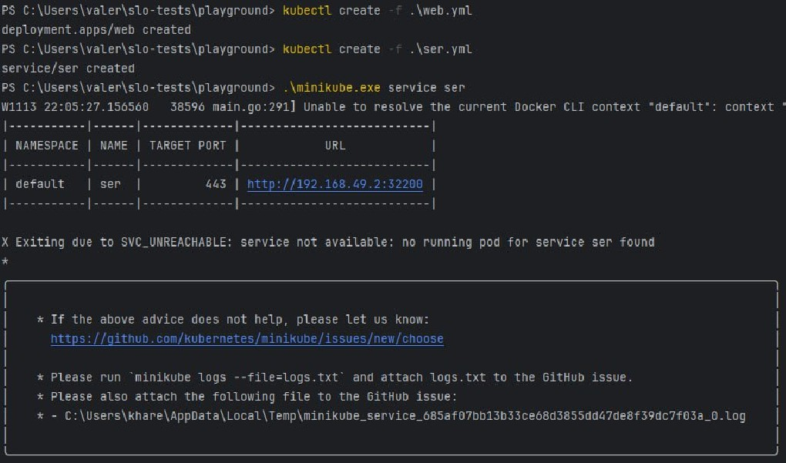

# Лабораторная работа № 2
### Команда
- Соболевская Надежда K34212
- Осипова Валерия K34202
- Гончаров Андрей K34211
- Донина Дарья К34202

## Задание

Поднять kubernetes кластер локально, в нём развернуть свой сервис, используя 2-3 ресурса kubernetes.

## Основная часть

1. Устанавливаем инструменты для работы с Kubernetes `kubectl` с помощью команды:
```
curl -LO https://dl.k8s.io/release/v1.28.3/bin/windows/amd64/kubectl.exe
```

А также инструмент для запуска Kubernetes - Minikube по прямой ссылке из браузера.

2. Запустим minikube с помощью команды:

```
minikube start --driver=docker
```


3. Создадим файл web.yml:

```
apiVersion: apps/v1
kind: Deployment

metadata:
  name: web
  labels:
    app: web

spec:
  selector:
    matchLabels:
      app: web

  replicas: 2

  template:
    metadata:
      name: web
      labels:
        app: web
    spec:
      containers:
        - name: web
          image: valeriya/web-server

```
В файле указан kind - Deployment. Он отвечает за развертывание подов, следит за их состоянием. Параметр replicas отвечает за количетсво экземпляров объекта. В нашем случае их будет 2.

Для создания файла выполним команду:

```
kubectl create -f ./web.yml
```

Для получения deployments и подов выполним команды:
```
kubectl get deployments 
kubectl get pods
```


4. Создаем файл для сервиса ser.yml со следующим содержимым:

```
apiVersion: v1
kind: Service

metadata:
  name: ser

spec:
  type: LoadBalancer
  ports:
    - targetPort: 443
      port: 443
      nodePort: 32200
  selector:
    app: web
```

В качестве сервиса был выбран LoadBalancer. Он обеспечивает баланс нагрузки для сервиса.

Для создания файла выполним команду:

```
kubectl create -f ./ser.yml
```

5. Проверим работу сервиса.

Для этого выполним команду:

```
./minikube.exe service ser
```


Переходим по адресу и в браузере видим ответ от сервера.


6. Вывод

В результате выполнения данной лабораторной работы был поднят kubernetes кластер локально, в нём был развернут http сервер.
