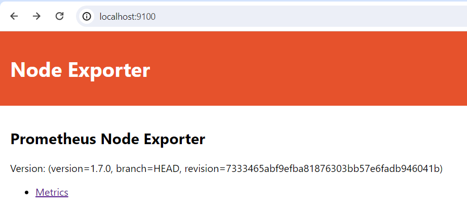
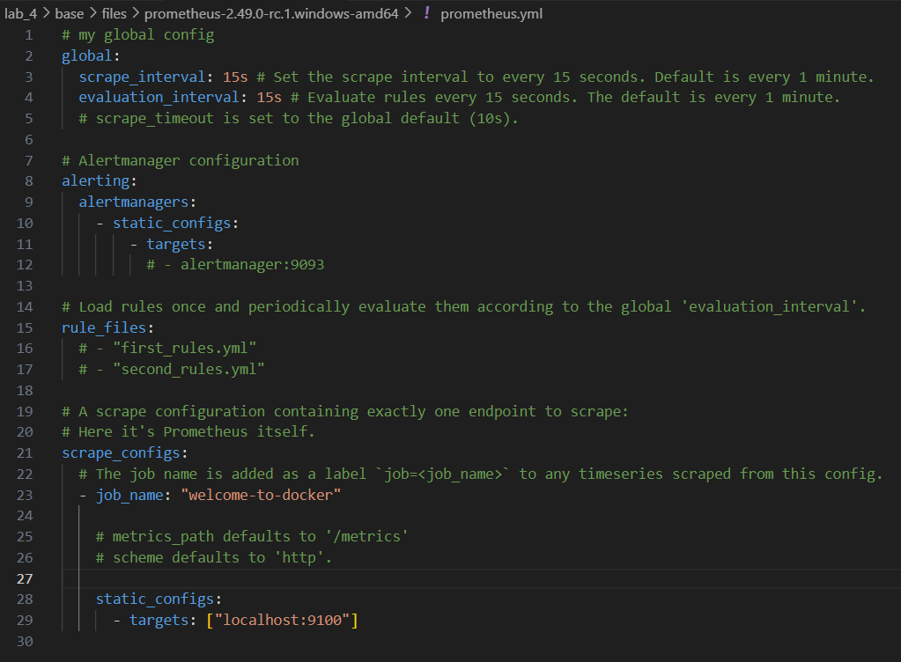
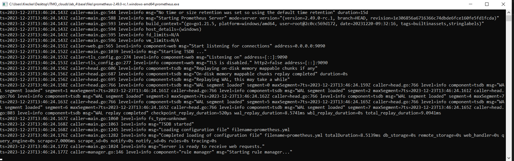
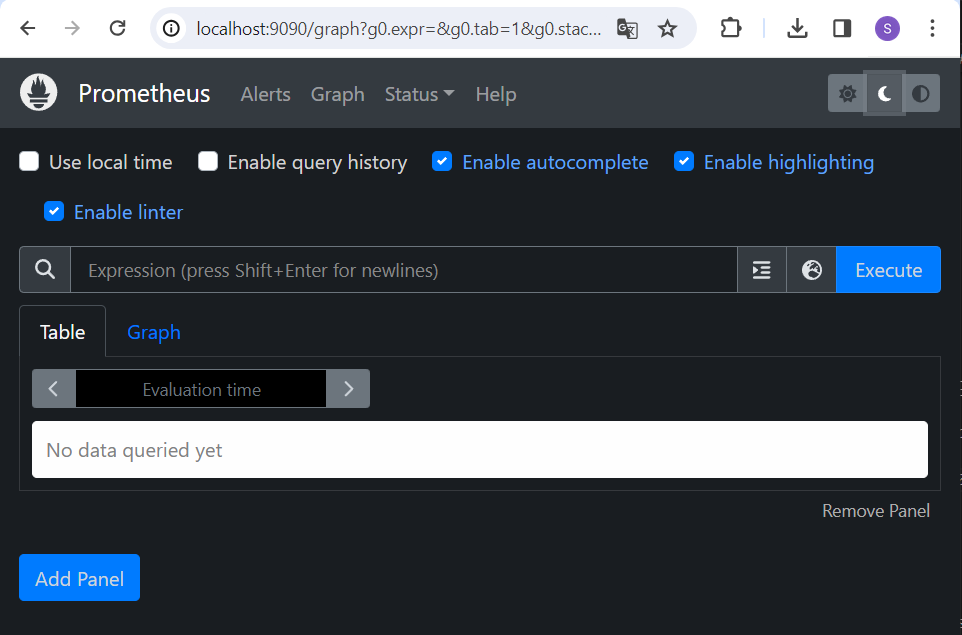
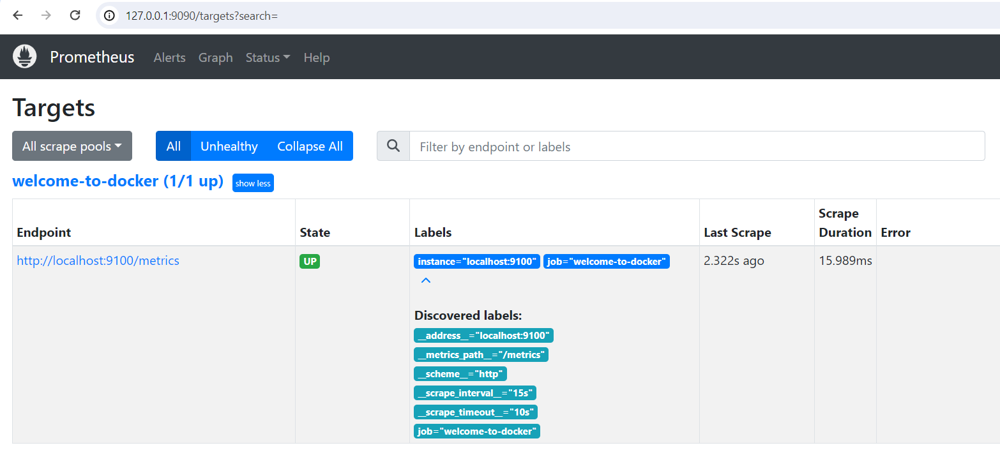
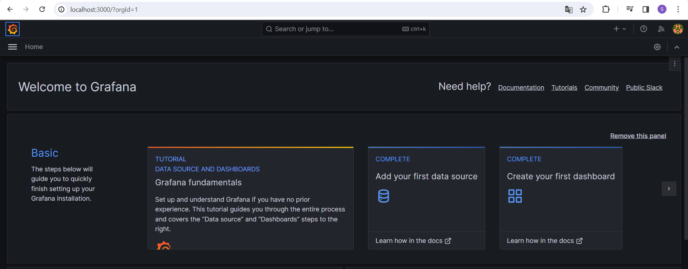
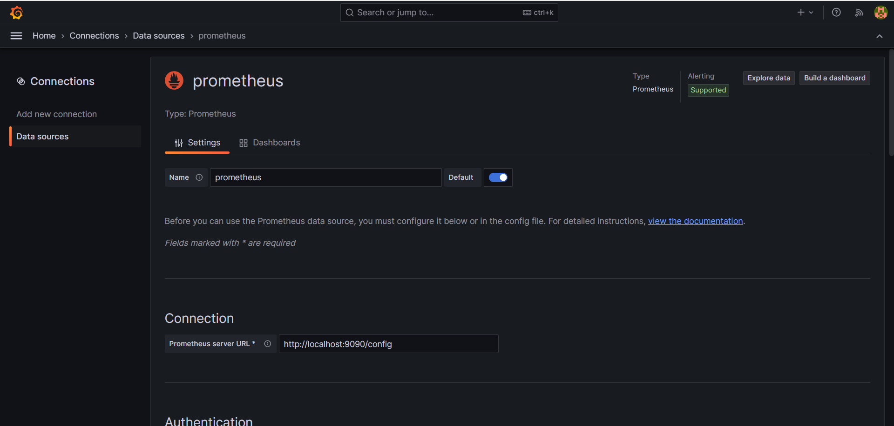
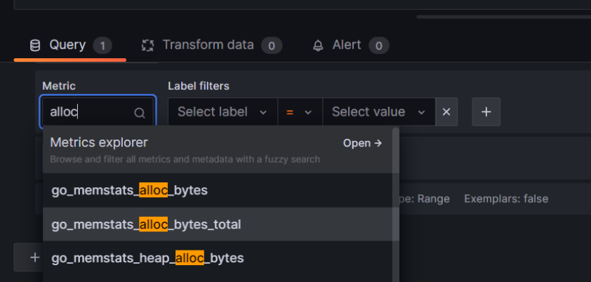
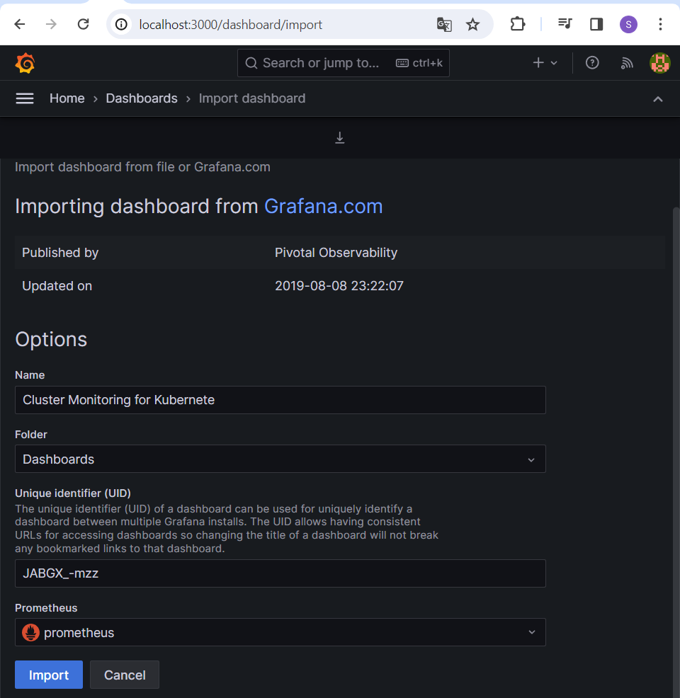
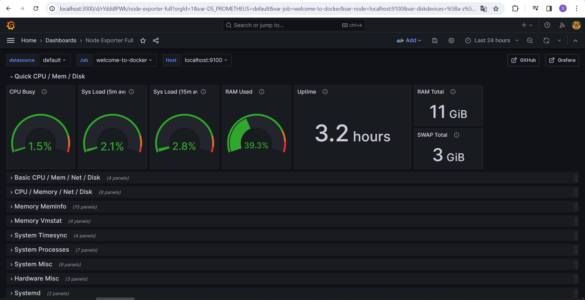

# Лабораторная работа № 4
### Команда
- Соболевская Надежда K34212
- Осипова Валерия K34202
- Гончаров Андрей K34211
- Донина Дарья К34202

## Задание

Сделать мониторинг сервиса, поднятого в kubernetes

## Основная часть

1. Запускаем сервис с предустановленным экспортером метрик prometheus


```
docker run -d --name prometheus-exporter -p 9100:9100 prom/node-exporter
```



2. Скачиваем prometheus для Windows, настраиваем prometheus.yml и далее запускаем prometheus.exe 

Меняю название и порт нашего сервиса



Запускаю exe



3. Открываем prometheus в браузере по адресу 127.0.0.1:9090



4. Проверяем доступность цели



5. После установки grafana, открываем grafana  по адресу localhost:3000

- уснановка графана
- открываем grafana  по адресу localhost:3000 
- меняем пароль от пользователя admin

далее видим следующее окно



6. Подключаем prometheus к grafana



7. Создаём dashboard

Можно создать с нуля



Но мы импортируем готовый шаблон в grafana



8. Открываем dashboard




## Вывод

В результате выполнения данной лабораторной работы был поднят сервис отправляющий метрики в kubernates, настроена связь grafana и kubernates, оформлено отображение метрик в dashboard grafana.